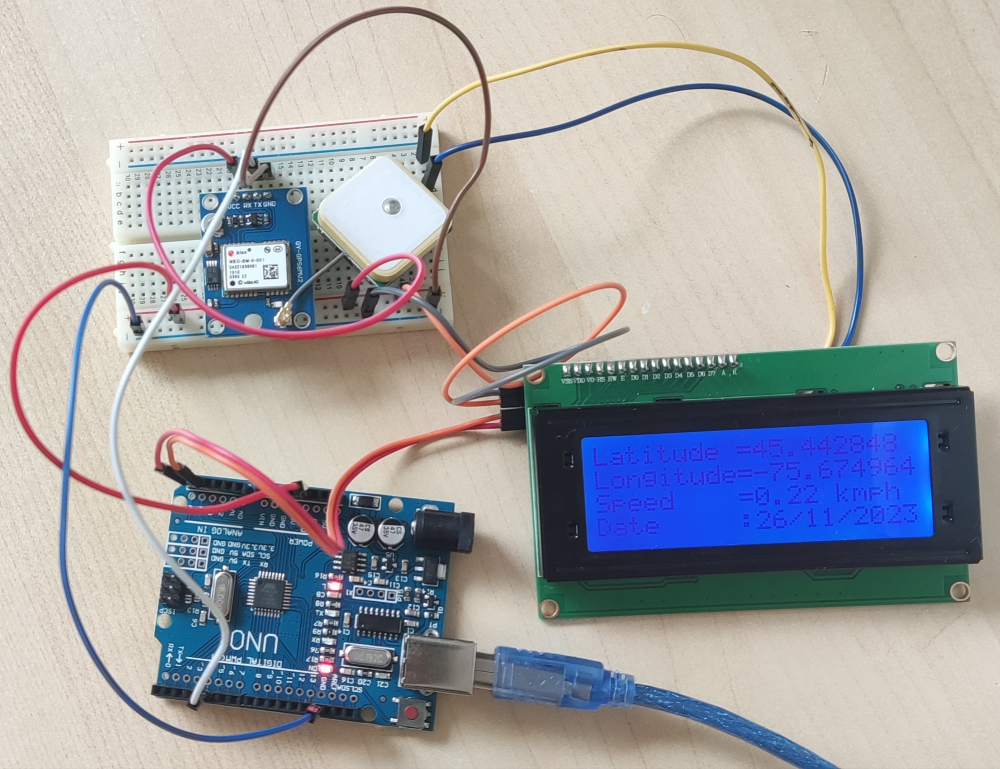

# E-Bike GPS and Speed Monitoring Project

## Project Overview
This project integrates a GPS-based navigation and speed monitoring system into an e-bike using an Arduino microcontroller, a NEO-6M GPS module, and a 20x4 LCD display. It aims to provide e-bike riders with real-time location and speed data, enhancing safety and experience.

## System Image

## Component Connections
The following table outlines the connections between the Arduino, the NEO-6M GPS module, and the 20x4 LCD display.

| Arduino Pins | NEO-6M GPS Module | 20x4 LCD Display |
| ------------ | ----------------- | ---------------- |
| RX           | TX                | -                |
| SDA (A4)     | -                 | SDA              |
| SCL (A5)     | -                 | SCL              |
| 5V           | VCC               | VCC              |
| GND          | GND               | GND              |

- "RX" on Arduino connects to "TX" on NEO-6M GPS Module.
- "SDA" and "SCL" on Arduino are used for I2C communication with the LCD Display.
- Both the GPS module and the LCD display are powered by the 5V and GND pins on the Arduino.

## Further Information
For more details about the project, including the software implementation and testing results, please refer to the full project documentation.

